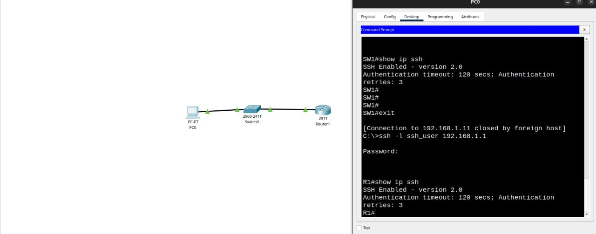
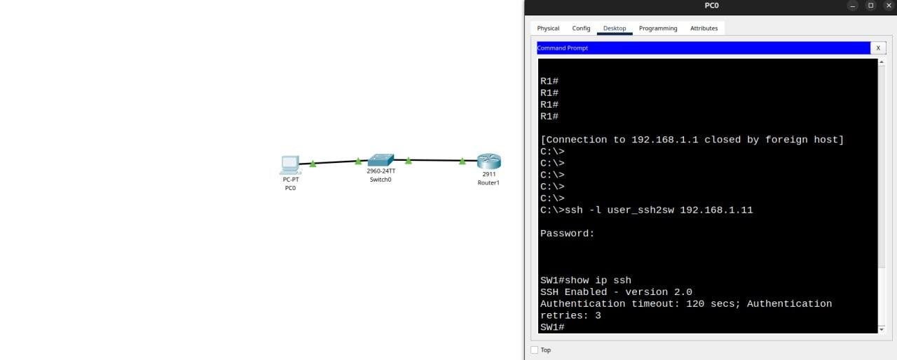
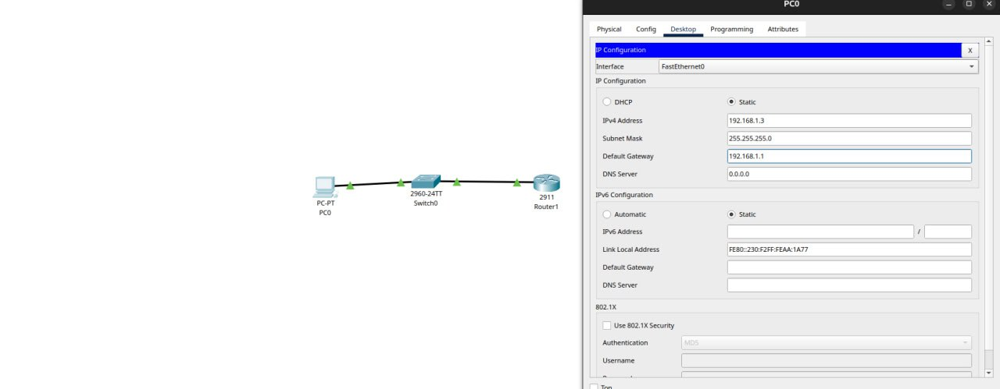

# Лабораторная работа. Доступ к сетевым устройствам по протоколу SSH

## Топология:  
  

## Таблица адресации:  

    | Device  | Interface | IP-address/prefix         |
    | ------- | --------- | ------------------------- |
    | R1      | G0/1      | 192.168.1.1 ip address    |
    |         |           | 255.255.255.0 mask        |
    | ------- | --------- | ------------------------- |
    | SW1     | VLAN 1    | 192.168.1.11 ip address   |
    |         |           | 255.255.255.0 mask        |
    |         |           | 192.168.1.1 default route |
    | ------- | --------- | ------------------------- | 
    | PC-A    | NIC       | 192.168.1.3 ip address    |
    |         |           | 255.255.255.0 mask        |
    |         |           | 192.168.1.1 default route |  

## Последовательность настройки коммутатора cisco 2960:  

1. Задать имя сетевого устройства:  
`enable`  
`config terminal`  
`hostname SW1`
`ip domain-name sw.otus.ru`

2. Защита устройства и первичная настройка для возможности удаленного доступа:  
`line con 0` (Защита консольного подключения)  
`password cisco`  
`login`    
`end`  

`configure terminal` (Защита рут режима)  
`enable secret class`  
`exit`  

`configure terminal`  
`line vty 0 4` (Добавляем 5 виртуальных терминалов с паролем для удаленного подлючения)     
`login local`  
`transport input ssh` (Включаем службу ssh на свиче)  
`end`

`configure terminal`  
`service password-encryption` (Шифрование паролей - проверить можно командой show running-config)  
`exit` 

3. Баннер  
`configure terminal`  
`banner motd #`  
`Наш баннер`
`#`
      
4. Настройка виртуальго интерфейса коммутарора:  
`configure terminal`  
`interface vlan 1`  
`ip address 192.168.1.11 255.255.255.0`    
`ip default-gateway 192.168.1.1`    
`no shutdown`  

5. Генерация ssh-ключей:  
`configure terminal`  
`crypto key generate rsa general-keys modulus 2048`  
`username user_ssh2sw privilege 15 secret cisco`  
`ip ssh version 2`

6. Общие настройки для удобства работы:  
`configure terminal`  
`no ip domain-lookup` (Маршрутизатор или коммутатор перестает отправлять запросы на разрешение имен в DNS-серверы)  
`line con 0`  
`logging synchronous` (Чтобы консольные сообщения не прерывали выполнение команд)   

7. Сохранение текущей конфигурации в энергонезависимую память nvram в рут режиме:  
`enable`  
`copy running-config startup-config`  

## Последовательность настройки маршрутизатора Cisco 2911:  

1. Задать имя сетевого устройства:  
`enable`  
`config terminal`  
`hostname R1`
`ip domain-name otus.ru`

2. Защита устройства и первичная настройка для возможности удаленного доступа:  
`line con 0` (Защита консольного подключения)  
`password cisco`  
`login`    
`end`  

`configure terminal` (Защита рут режима)  
`enable secret class`  
`exit`  

`configure terminal`  
`line vty 0 4` (Добавляем 5 виртуальных терминалов с паролем для удаленного подлючения)  
`login local`  
`transport input ssh` (Включаем службу ssh на маршрутизаторе)  
`end`

`configure terminal`  
`service password-encryption` (Шифрование паролей - проверить можно командой show running-config)  
`exit` 

3. Баннер  
`configure terminal`  
`banner motd #`  
`Наш баннер`
`#`
      
4. Настройка виртуальго интерфейса коммутарора:  
`configure terminal`  
`interface g0/1`    
`ip address 192.168.1.1 255.255.255.0`        
`no shutdown`  

5. Генерация ssh-ключей:  
`configure terminal`  
`crypto key generate rsa general-keys modulus 2048`  
`username user_ssh privilege 15 secret cisco`  
`ip ssh version 2`

6. Общие настройки для удобства работы:  
`configure terminal`  
`no ip domain-lookup` (Маршрутизатор или коммутатор перестает отправлять запросы на разрешение имен в DNS-серверы)  
`line con 0`  
`logging synchronous` (Чтобы консольные сообщения не прерывали выполнение команд)   

7. Сохранение текущей конфигурации в энергонезависимую память nvram в рут режиме:  
`enable`  
`copy running-config startup-config`  

## Вопрос для повторения  
Как предоставить доступ к сетевому устройству нескольким пользователям, у каждого из которых есть собственное имя пользователя?  
Ответ:  
Нужно создать каждому пользователю собственное имя, уровень привилегий и пароль  

## Скриншоты:      
> Подключение к r1 с хоста pc0:       
  

> Подключение к sw1 с хоста pc0:  
  

> Мануальная конфигурация хоста:  
    
